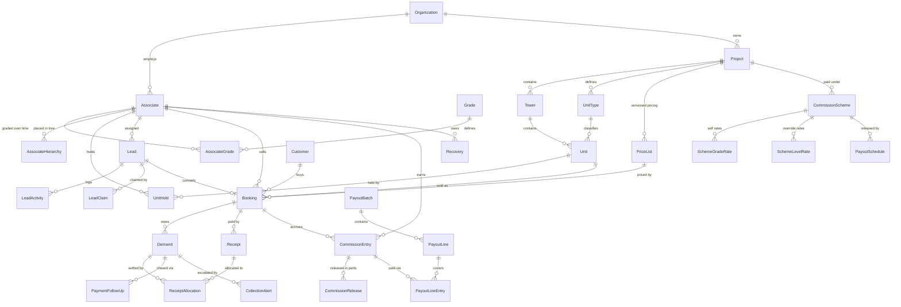

# 03 — Data Model

Authoritative definition: [`prisma/schema.prisma`](../prisma/schema.prisma) —
58 models, 33 enums. This document is the map and the reasoning; the schema is
the contract.

## Domain map

## Entity dictionary

### People & network

| Model | Purpose | Watch out for |
|---|---|---|
| `Associate` | The person. KYC, bank, engagement type | `engagementType` drives the **entire tax path** |
| `Grade` | Rank + qualification thresholds + hold quota | `rank` ordering is meaningful |
| `AssociateGrade` | Effective-dated grade assignment | **Never update to change a grade** — close and insert |
| `AssociateHierarchy` | Effective-dated tree placement, with materialised `path` | Move recomputes the whole subtree's paths |
| `HierarchyChangeLog` | Who moved whom, and how many descendants came along | Moves get disputed; this is the record |

### Inventory

| Model | Purpose | Watch out for |
|---|---|---|
| `Project` | RERA metadata + hold policy config | `reraValidTill` gates marketing |
| `UnitType` | Carpet / built-up / saleable areas | Three different numbers — see [glossary](19-GLOSSARY.md) |
| `Unit` | The sellable thing | `currentHoldId` is a read convenience, **not** the lock |
| `PriceList` / `PriceListItem` | Versioned pricing, never mutated | A booking pins its version |
| `ChargeHead` | Charge components | `countsTowardCommission` builds the commissionable base |
| `UnitHold` | Timed exclusive claim | Exclusivity is the **partial unique index**, not this table alone |

### Sales & collections

| Model | Purpose | Watch out for |
|---|---|---|
| `Booking` | The pivot | `agreementValue` ≠ `commissionableValue`. Both frozen at confirmation |
| `CostSheetLine` | Line-by-line snapshot | Regenerating from the price list will not match what was signed |
| `Demand` | One scheduled amount owed | **No `paidAmount` column** — derive from allocations |
| `Receipt` | Money received | `receivedOn` ≠ `clearedOn`. Release uses `clearedOn` |
| `ReceiptAllocation` | Receipt ↔ demand, many-to-many | The only source of truth for what a demand has been paid |
| `CollectionAlert` | One row per (demand, rung) | The unique constraint is what stops re-nagging |

### Commission & payouts

| Model | Purpose | Watch out for |
|---|---|---|
| `CommissionScheme` | Versioned rules per project | `baseDefinition` decides the commissionable base |
| `CommissionEntry` | **The ledger.** Append-only | `snapshot` is what keeps old statements explainable |
| `CommissionRelease` | Partial release against a trigger | Unique on (entry, triggerType, triggerRef) |
| `PayoutLineEntry` | Which entries a payment covered | Without it a statement has no provenance |
| `Recovery` | Clawback owed back | Deduction is capped per cycle |
| `Adjustment` | Manual credit/debit; also migrated opening balances | `AdjustmentType.OPENING_BALANCE` |
| `TaxRate` | Effective-dated TDS rates | Rows, not constants — they change at every Finance Act |

## Design decisions worth knowing

**Why both effective dating and snapshots.** Effective-dated tables let you query
history. Snapshots mean you don't have to. If the tree is restructured or a
`validTo` is set wrong, every historical payout is still reconstructable from its
own row. Belt and braces, on the one thing that must never break.

**Why no `paidAmount` on `Demand`.** One cheque routinely settles two demands, and
one demand routinely takes three transfers. A denormalised total drifts, and once
finance catches it drifting they stop trusting the whole system. Derive it.

**Why `commissionableValue` is stored, not computed.** The scheme may be versioned
after the booking. The charge heads may be reconfigured. Freezing the resolved
figure at confirmation is what makes the number stable.

**Why `path` on the hierarchy.** "All of my downline" is a prefix scan instead of
a recursive CTE. Team dashboards hit this on every load.

**Why `orgId` everywhere in a single-tenant product.** It costs one column now and
saves a full-table migration if this ever becomes multi-tenant or needs RLS.
